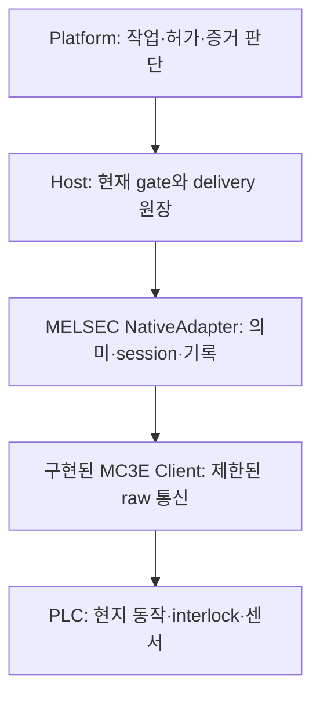

# MELSEC Host 어댑터 연결 계획

작성 2026-09-12. **후속 단계 계획이다. 2026-09-12에 제한 EnsureState NativeAdapter와 native journal 및 Host library 시험을 추가했다.** 상세 범위와 publication 전제는 [현재 구현 명세](../../runtime/rx-host/MELSEC_ADAPTER.md)를 따른다. phase58에서 signed-package factory와 초기화를 연결했다. 실제 현장 검증은 미완료다. [통신 라이브러리](README.md)의 codec/Client 시험과 구분한다. 확정 [base](../../sdk/spec/contracts/v1.0/README.md)·[cell](../../sdk/spec/cell_operations/v1.0/README.md) 계약과 [Host 서비스](../../runtime/rx-host/HOST_SERVICE.md)를 바꾸지 않는다.

## 1. 연결 순서와 책임

통신 방법을 알았다는 이유로 물리 동작을 구현 완료로 표시하지 않는다. 먼저 아래 현장 입력을 semantic profile로 검토하고, 모의 PLC의 실제 상태 변화와 장애를 재현한 다음 Host gate/원장과 연결한다. 어댑터를 이미지에 넣는 것은 그 뒤의 단계다.

## 2. semantic profile의 필수 입력

| 구분 | 필요한 입력 | 누락·불일치 처리 |
|---|---|---|
| 장치 identity | 모델·firmware·PLC 프로그램/파라미터 digest·설치 identity | 해당 binding 부적합 |
| 접근 | reviewed MC 설정·endpoint·RUN 중 쓰기 정책·M/D 할당 | startup 미지원 |
| 작업 | 기존 Intent 종류/정규 본문·profile digest·M 요청 값·허용 목적 | 매핑 없는 작업 거부 |
| 요청 의미 | level/edge/pulse, PLC consume/reset 주체, 동일 요청 반복 시 효과 | 알 수 없는 재진입 거부 |
| 완료 | 별도 센서/상태 source·expected value·freshness·settle 조건 | ACK만으로 완료 금지 |
| 세대 | PLC restart/프로그램 재시작/통신 세대 구분과 ABA 방지 | 이전 작업 현재성 없음 |
| 관측 | 원본 갱신 규칙·유효성·stale 한도·일관 묶음 보장 | 관측 quality/age 불명 |
| 지지와 인계 | 소재·척·로봇의 support, 잔여 queue와 control 상태 | 자원 해제 금지 |
| 종료 | 명시적 drop_allowed 근거와 TCP 상실 시 PLC 동작 | 정상 종료 owner 보존 |
| 독립 보호 | Host/전원/통신 상실 시 PLC·로봇의 현지 보호 및 검증 근거 | physical qualification 불가 |

사진에서 이 주소·프로그램 의미는 확인되지 않았다. 예시 M/D 번호는 모의 시험용이다. 기존 장비의 spare 접점만 연결하면 완료된다는 전제를 두지 않는다. 어떤 항목은 PLC 수정 없이 얻을 수 있고 어떤 항목은 장비 제작사의 협의·프로그램 변경이 필요하므로 현장 조사 결과에 따라 결정한다.

## 3. 먼저 지원할 작업 종류의 판단

후보는 불리언 상태를 보장하는 `EnsureState`다. 예를 들어 별도 센서로 닫힘을 관측할 수 있고 PLC가 요청을 지속 상태로 해석한다면 단일 M 쓰기로 표현 가능할 수 있다. 이는 **조건부 후보**이며 현재 레이저 장비의 실제 command 의미로 확정하지 않는다.

edge/pulse로 공정 한 회를 시작하거나 한 번 집는 명령은 다른 계약이 필요하다. 동일 M bit 재설정, host 재접속, PLC가 request bit를 지운 뒤 재전송할 때 같은 작업이 다시 실행될 수 있다. 그런 공정을 EnsureState로 억지로 표현하지 않는다. PLC가 native request ID/ack ID를 저장하는 mailbox를 요구하면 현재 M-bit-only transport 범위를 명시적으로 확장해야 한다. 해당 ID·write transaction·commit strobe 의미를 먼저 설계한다.

이미 목표 상태가 관측된 경우에도 작업 완료 판정은 기존 Intent 완료 규칙을 따라야 한다. 현재 상태와 이 invocation의 인과적 실행 증거를 구별한다. `Lookup`으로 나중에 목표 상태를 봤다는 사실만으로 잃어버린 edge 명령의 성공을 재구성하지 않는다.

## 4. 장치 세대와 관측 일관성

Host boot UUID, TCP connection, PLC boot/프로그램 세대는 서로 다르다. 재접속 후 읽기에 성공했다고 기존 device session을 그대로 유지하지 않는다. PLC가 확인 가능한 세대를 제공하지 않는다면 재접속 뒤 이전 작업의 연속성을 증명하지 못한 것으로 처리한다.

`D` 여러 word로 구성한 counter를 한 번 읽었다는 사실만으로 원자성을 보장하지 않는다. 여러 read의 앞뒤 boot counter가 같아도 센서 묶음이 동일 scan에서 왔다는 보장은 없다. PLC가 만든 snapshot/sequence/commit marker와 갱신 규칙을 검증하거나, 원자성이 없는 독립 관측으로 표현해야 한다. counter wrap·retained value reset·프로그램 재시작에 따른 ABA도 포함한다.

시간은 Host read 시작/종료의 부트 시계를 기록한다. 장치 데이터의 실제 갱신 한도를 확인하기 전에는 읽기 완료 시각을 acquisition 시각으로 바꿔 `origin_age_bounded=true`를 만들지 않는다. PLC mirror와 안전회로 원본을 혼동하지 않는다.

## 5. 영속 작업 경계

상위 Host의 SEND_ENTERED commit 후에만 NativeAdapter가 진입한다. 어댑터의 native journal에는 operation/invocation/intent digest/profile digest/device session/실제 요청 bytes hash/PLC 세대를 **native write 전에** 원자 기록한다. Host DB와 장비 효과 사이에 공통 transaction이 있다고 주장하지 않는다.

| 장애 경계 | 보관할 사실 | 재시작 시 행동 |
|---|---|---|
| Host SEND_ENTERED 전 | 준비/허가 원장 | 기존 규범에 따라 void/재판단 |
| Host commit 후 native journal 전 | Host는 진입 의도를 기록 | native 미실행을 추정하지 않고 기존 조정 경로 |
| native journal commit 후 실제 write 전 | 송신 예약·원래 ID와 body | 재시작 자동 송신 금지; 읽기로 조정 |
| write 후 reply 전 | PLC 효과 가능, 결과 미확인 | 동일 작업 write 재전송 금지 |
| ACK 후 센서 완료 전 | 메모리 쓰기 ACK만 확인 | 완료/실패를 따로 관측 |
| 완료 capture 저장 후 Host evidence 전 | 원래 session의 불변 capture | Lookup으로 회수; native 재호출 없음 |

동일 operation/invocation의 다른 body는 충돌이다. 과거 capture는 보존하되 새 device session의 현재 완료로 바꾸지 않는다. 기존 capture와 모순되는 후기 사실은 덮어쓰지 않고 분쟁으로 보관한다. 원장이 유실·교체됐을 때 새 원장을 만들어 정상 계속하는 경로는 허용하지 않는다.

읽기만으로 결과를 결정할 수 없거나 세대 연속성을 증명하지 못하면 결과는 UNKNOWN으로 남기고 관련 자원·복구 차단을 유지한다. **새 operation/invocation ID 발급은 미해결 물리 효과를 우회하는 근거가 아니다.** 기존 cell 계약의 개입 case와 승인된 복구 절차에서 필요한 현지 확인·조치·재검증 근거를 기록하고, 결과 지식과 자원 처분을 따로 판단해야 한다. 작업자 확인 한 번이나 알림 ACK가 자동으로 성공·해제·재시작을 만들지 않는다. 구체 역할·현지 확인 항목은 첫 현장의 운영 복구 명세에 연결할 미결 입력이다.

## 6. 종료·보호와 Host 연결

AdapterFactory의 `open_passive`는 PLC 요청 쓰기·reset·servo enable을 해서는 안 된다. 필요한 read도 startup 문맥/범위 검사 후 수행한다. 초기화는 장치를 열지 않는 기존 Host 규칙을 유지한다.

`LocalProtection.react`는 Host gate/DB lock에 의존하지 않고 새 명령의 admission을 latch한다. **소프트웨어 latch가 이미 실행 중인 물리 동작을 멈춘다는 뜻은 아니다.** 소프트웨어 emergency 명령이나 자동 척 해제를 보호의 대체물로 추가하지 않는다. 기계의 독립 보호를 어떤 신호·시험으로 검증했는지 연결한다.

정상 stop은 `no_pending_commands`, 필요한 support, 명시적 `safe_to_drop`를 모두 검사한다. 읽기 연결이 끊어져 근거를 얻지 못하면 owner를 유지하고 확인 필요를 표시한다. stop 중 진단용 재접속을 허용하더라도 write admission은 복원하지 않는다. 새 세대 관측이 과거 pending 작업을 해소했는지는 별도로 판단한다. 수치 timeout만으로 kill하지 않는 기존 Host 종료 규칙을 유지한다.

## 7. 구현·인수 순서

| 순서 | 산출물 | 통과 조건 |
|---|---|---|
| A — 구현됨 | 제한 MC codec/Client와 loopback fault tests | raw protocol와 no-retry 검증; 완료 판정 없음 |
| B | semantic profile validator·NativeAdapter·native journal | 매핑/세대/작업 동일성·모의 PLC completion 분리 |
| C | Host gate/qualification/Lookup/handover/stop 통합 | 모의 시험에서 허가 없는 native writes 0, 중간 crash 후 동일 invocation의 추가 native write 0; 모의 효과 계수는 별도로 대조 |
| D | release-owned factory·pinned startup·image recipe | init 무동작, passive open, 권한·세대 mismatch 거부 |
| E | 실제 대상의 현장 검증·운영 복구·인수 | 검토된 주소/프로그램/firmware·기계 보호·작업자 개입과 물리 시험 근거 |

B/C의 필수 반례: 쓰기 ACK만 도착, completion sensor 고착, request bit 자동 해제, PLC reboot와 TCP reconnect, counter wrap, 여러 read 사이 상태 변화, native journal commit 전후 crash, Host evidence commit 전후 crash, read timeout 후 늦은 response, drop proof 소실, 보호 latch 중 진입, 모의 binding의 외부 endpoint 주입. expected result와 native write count를 서로 독립적으로 확인한다.

A와 B의 제한 상태 보장 경로, C의 Host library 통합을 코드/모의 시험으로 다뤘다. D의 MELSEC signed-package startup과 native identity 공개도 구현했다. B/C의 물리적 자료 판단·전체 복구/qualification, 일반 driver의 D와 E는 미완료이며 자사 OMY/Dynamixel/ROS 기본 지원 목표도 유지한다. 미쓰비시 라이브러리 추가로 자사 지원이 완료되거나 선택 사항으로 바뀌지 않는다. 전체 구현 요구는 [추적표](../../../docs/implementation/requirements.md)를 따른다.
