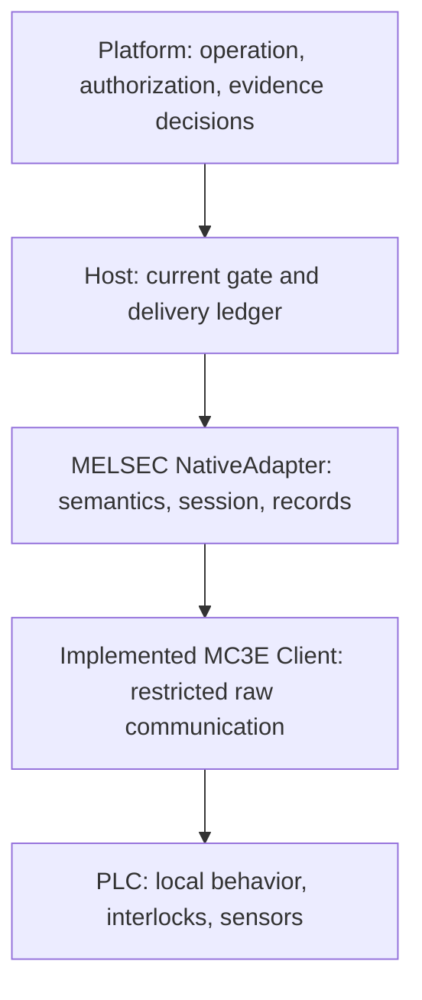

# MELSEC Host adapter integration plan

Written 2026-09-12. **This is a subsequent-phase plan. On 2026-09-12, a restricted EnsureState NativeAdapter, native journal, and Host library tests were added.** Detailed scope and publication prerequisites follow the [current implementation specification](../../runtime/rx-host/MELSEC_ADAPTER.md). Phase58 connected the signed-package factory and initialization. Actual site validation is incomplete. Distinguish this from codec/Client tests in the [communication library](README.md). The frozen [base](../../sdk/spec/contracts/v1.0/README.md) and [cell](../../sdk/spec/cell_operations/v1.0/README.md) contracts and [Host service](../../runtime/rx-host/HOST_SERVICE.md) are unchanged.

## 1. Integration order and responsibilities

Knowing how to communicate does not establish completed implementation of physical behavior. First review the following site inputs as a semantic profile, reproduce actual state changes and faults in a simulated PLC, and then connect the Host gate/ledger. Adding the adapter to the image comes afterward.

## 2. Required semantic profile inputs

| Category | Required input | Handling of missing/mismatched input |
|---|---|---|
| Device identity | Model, firmware, PLC program/parameter digest, installation identity | Binding is unsuitable |
| Access | Reviewed MC configuration, endpoint, write-during-RUN policy, M/D assignments | Startup unsupported |
| Operation | Existing Intent kind/canonical body, profile digest, M request value, allowed purpose | Reject unmapped operations |
| Request semantics | Level/edge/pulse, PLC consume/reset owner, effects of repeating the same request | Reject re-entry with unknown effects |
| Completion | Separate sensor/state source, expected value, freshness, settle conditions | ACK alone cannot establish completion |
| Generation | Distinguish PLC restart/program restart/communication generations; prevent ABA | No currentness for an earlier operation |
| Observation | Source update rules, validity, stale limits, coherent group guarantees | Unknown observation quality/age |
| Support and handover | Support by material/chuck/robot, remaining queues and control state | Resource release forbidden |
| Shutdown | Explicit drop_allowed evidence and PLC behavior on TCP loss | Preserve the normal-shutdown owner |
| Independent protection | Local PLC/robot protection on Host/power/communication loss and validation evidence | Physical qualification unavailable |

These addresses and program semantics were not established from the photographs. Example M/D numbers are for simulation tests. Do not assume that connecting spare contacts on existing equipment completes the integration. Some inputs may be obtainable without modifying the PLC; others may require coordination with the machine builder and program changes. Decide based on site investigation results.

## 3. Deciding which operation kind to support first

The candidate is `EnsureState`, which assures a boolean state. For example, if a separate sensor can observe closure and the PLC interprets the request as a persistent state, a single M write might represent it. This is a **conditional candidate**, not an established interpretation of the actual laser machine's commands.

Commands that start one process cycle or perform one grasp through an edge/pulse require a different contract. Resetting the same M bit, reconnecting the Host, or retransmitting after the PLC clears the request bit may execute the operation again. Do not force such processes into EnsureState. If the PLC requires a mailbox that stores native request IDs/ack IDs, explicitly extend the current M-bit-only transport scope. First design the ID, write transaction, and commit strobe semantics.

Even if the target state is already observed, completion decisions must follow the existing Intent completion rules. Distinguish current state from causal execution evidence for this invocation. A later observation of the target state through `Lookup` cannot by itself reconstruct success for a lost edge command.

## 4. Device generations and observation consistency

Host boot UUID, TCP connection, and PLC boot/program generation are different identities. A successful read after reconnect must not preserve the old device session automatically. If the PLC exposes no verifiable generation, treat continuity of earlier operations after reconnect as unproven.

A single read of a counter spanning several `D` words does not establish atomicity. Equal boot counters before and after several reads do not guarantee that the sensor group came from one scan. Validate PLC-produced snapshots/sequences/commit markers and update rules, or represent the values as independent non-atomic observations. Include ABA caused by counter wrap, retained-value reset, and program restart.

Record time using the Host boot clock at read start/end. Before establishing the actual bound on device-data updates, do not substitute read completion time for acquisition time to produce `origin_age_bounded=true`. Do not confuse a PLC mirror with the original safety circuit.

## 5. Durable operation boundary

The NativeAdapter enters only after the higher-level Host commits SEND_ENTERED. The adapter's native journal atomically records operation/invocation/intent digest/profile digest/device session/actual request-bytes hash/PLC generation **before the native write**. This does not claim a shared transaction between the Host DB and device effects.

| Failure boundary | Facts to preserve | Restart behavior |
|---|---|---|
| Before Host SEND_ENTERED | Preparation/authorization ledger | Void/reassess under the existing specification |
| After Host commit, before native journal | Host has recorded intent to enter | Use the existing reconciliation path without inferring no native execution |
| After native journal commit, before actual write | Send reservation, original IDs and body | No automatic send on restart; reconcile by reading |
| After write, before reply | PLC effects possible; result unconfirmed | Do not retransmit the same operation's write |
| After ACK, before sensor completion | Only the memory-write ACK is confirmed | Observe completion/failure separately |
| After completion capture is stored, before Host evidence | Immutable capture from the original session | Retrieve through Lookup; no native reinvocation |

A different body for the same operation/invocation is a conflict. Preserve earlier captures without converting them into current completion in a new device session. Late facts that contradict an existing capture are retained as a dispute rather than overwriting it. No path may create a new ledger and continue normally after ledger loss/replacement.

If reads cannot determine the outcome or generation continuity cannot be proven, leave the result UNKNOWN and retain the relevant resource/recovery blocks. **Issuing new operation/invocation IDs is not grounds for bypassing unresolved physical effects.** Record the required local checks, actions, and revalidation evidence through intervention cases and approved recovery procedures in the existing cell contract, and decide outcome knowledge and resource disposition separately. A single operator confirmation or notification ACK does not automatically create success, release, or restart. Specific roles and local check items remain unresolved inputs to connect to the first site's operational recovery specification.

## 6. Shutdown, protection, and Host integration

AdapterFactory's `open_passive` must not write PLC requests, reset, or enable servos. Even necessary reads occur only after startup context/scope checks. Initialization retains the existing Host rule of not opening devices.

`LocalProtection.react` latches new-command admission without depending on the Host gate/DB lock. **A software latch does not mean that physical behavior already in progress stops.** Do not add software emergency commands or automatic chuck release as substitutes for protection. Connect the signals/tests that validated the machine's independent protection.

Normal stop checks `no_pending_commands`, required support, and explicit `safe_to_drop`. If loss of the read connection prevents obtaining evidence, preserve the owner and indicate that confirmation is required. Even when diagnostic reconnection is allowed during stop, write admission is not restored. Whether new-generation observations resolve earlier pending operations is decided separately. Retain the existing Host shutdown rule that does not kill solely after a numeric timeout.

## 7. Implementation and acceptance order

| Stage | Deliverable | Passing condition |
|---|---|---|
| A — implemented | Restricted MC codec/Client and loopback fault tests | Validate raw protocol and no-retry behavior; no completion decision |
| B | Semantic profile validator, NativeAdapter, native journal | Mapping/generation/operation identity; separate simulated PLC completion |
| C | Host gate/qualification/Lookup/handover/stop integration | In simulation, 0 unauthorized native writes and 0 additional native writes for the same invocation after an intermediate crash; compare simulated effect counts separately |
| D | Release-owned factory, pinned startup, image recipe | Initialization without actions, passive open, rejection of authority/generation mismatches |
| E | Actual target's site validation, operational recovery, acceptance | Reviewed addresses/program/firmware, mechanical protection, operator intervention, and physical test evidence |

Required B/C counterexamples: only a write ACK arrives; completion sensor stuck; request bit cleared automatically; PLC reboot and TCP reconnect; counter wrap; state changes between reads; crashes before/after native journal commit; crashes before/after Host evidence commit; late response after a read timeout; lost drop proof; entry while protection is latched; external endpoint injection into a simulation binding. Verify expected results and native write counts independently.

The restricted state-assurance paths in A and B and Host library integration in C have been covered by code/simulation tests. D's MELSEC signed-package startup and native identity exposure are also implemented. Physical evidence decisions and complete recovery/qualification in B/C, D for general drivers, and E remain incomplete. This PLC integration is one example among multiple device integrations and does not replace qualification of other devices. The overall implementation requirements follow the [traceability table](https://github.com/jack0682/rx_docs/blob/main/docs/implementation/requirements.md).
