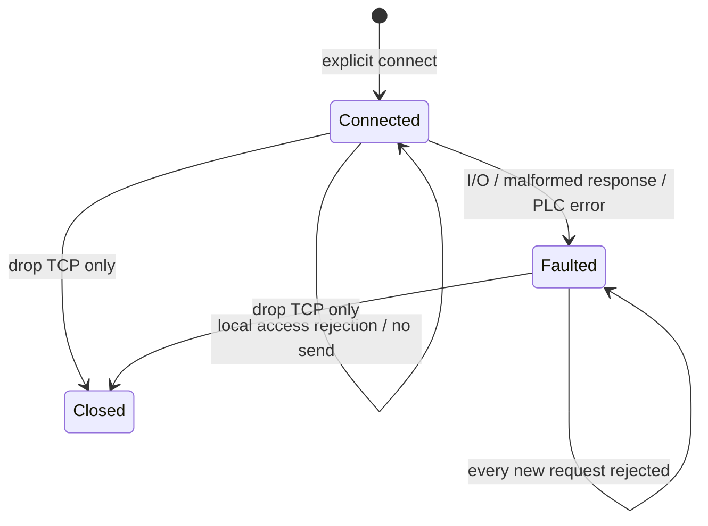

# MELSEC MC 3E communication layer — implementation draft

Written 2026-09-12. Status: **communication library implemented and local simulated TCP tests completed; selectable as a Host backend through a signed device package; actual site qualification remains incomplete**.

This library sends restricted MC requests to Mitsubishi PLCs and interprets responses within `rx-solutions`. It does not depend on ROS or the Platform domain. Device-control authorization, ledger records, and completion decisions are the responsibility of the higher-level Host adapter. The current implementation of the restricted state-assurance adapter is documented in the [MELSEC Host specification](../../runtime/rx-host/MELSEC_ADAPTER.md). This library provides no installation, connection, or physical operating approval.

## 1. Target and evidence

The first laser PLC is the **Q03UDVCPU** in the photographs supplied by the user. That model is covered by the manufacturer's built-in Ethernet manual, which lists MC 0401 read and 1401 write commands. Actual port configuration, permission to write during RUN, and address assignment require site confirmation. [QnUCPU built-in Ethernet manual, §5](https://dl.mitsubishielectric.com/dl/fa/document/manual/plc/sh080811eng/sh080811engy.pdf).

The codec follows 3E binary frames, little-endian lengths/words, M=0x90, D=0xA8, 4 bits per bit value, and low-nibble zero padding for odd counts. Sources: [MC Protocol Reference, printed p43–44, p72–74, p90–96, Appendix 7](https://dl.mitsubishielectric.com/dl/fa/document/manual/plc/sh080008/sh080008ab.pdf).

The presence of a CC-Link module or remote I/O in a photograph does not establish MC addresses or control authority. MC access is a candidate for higher-level communication with the CPU and does not automatically replace existing CC-Link I/O circuits. This library is not a FANUC- or Siemens-compatible driver.

## 2. Implemented APIs and limits

| API | Actual handling | Response meaning |
|---|---|---|
| `Configuration::validate` | Check explicit addresses/routes/timeouts/access | Syntactic/local policy compliance, not site validation |
| `Client::connect` | Connect by TCP to the specified IPv4 address | No protocol request or automatic probe |
| `read_m(first,count)` | Read 1–64 M bits within an allowed range | Raw bool values from the current response; no time, freshness, or safety decision |
| `read_d(first,count)` | Read 1–32 D words within an allowed range | Raw u16 values; ordering/generation semantics are needed in the higher-level profile |
| `write_m(address,value)` | Write one explicitly listed M request bit | `WriteAcknowledgement` from an exact end-code-zero response |
| `is_faulted` | Query the connection's permanent fault state | Not a success/failure decision for an earlier operation |

`Configuration::write_m_frame` purely returns the bytes intended for one allowed M request so that they can be pinned in the native journal. There is no API for sending arbitrary bytes.

Other device codes, word writes, arbitrary frame transmission, remote RUN/STOP, program/parameter changes, and automatic resets/heartbeats are not exposed by the public API. Even M memory can trigger behavior through the PLC program, so a write is not treated as an ordinary variable edit.

`Configuration` explicitly specifies the endpoint, 5 route bytes, monitoring timer, connection/exchange timeouts, final M/D addresses under the CPU configuration, read ranges, and write-address list. Address numbers are **base-10 device numbers**. Actual CPU device-configuration limits are distinct from the wire's 24-bit limit. Ranges are sorted and nonoverlapping, and each read must fit inside a single allowed range. Read ranges and write addresses may overlap. Whether such an address can serve as completion evidence is checked separately by the semantic profile.

SIMULATION configuration permits only loopback endpoints. PHYSICAL configuration can syntactically express external addresses. All tests in this phase use loopback; PHYSICAL examples receive syntax checks only. This enum alone provides neither OS network isolation nor connection authority. Basic IPv4 unicast checks are performed; subnet-specific broadcast detection, firewalls, and site route allowlists belong to deployment.

## 3. Lost responses and connection state



Only one request is in flight on a 3E connection. `&mut Client` serializes concurrent exchanges. There is no automatic reconnect/retry; an object that faults continues rejecting requests. Creating a new Client still does not authorize resending an earlier operation. The operational adapter must provide stronger durable operation identity and prohibit re-entry.

Failures distinguish `BeforeSend` from `ExchangeEntered`. The latter conservatively indicates entry into the send boundary; it does not prove actual PLC receipt. Lost responses, format errors, and PLC error codes during a write exchange preserve `write_outcome_unknown=true`. Even an explicit PLC error does not let this layer infer absence of physical effects. A later call rejected as `BeforeSend` by the faulted object **does not change the earlier write's UNKNOWN state**.

A write ACK contains only address/requested_value. It does not contain completion, success, sensor state, or an operation ID. An ACK must not be converted directly into a successful NativeCapture. Reads are also raw responses and must not be automatically promoted to `origin_age_bounded=true` or a safety interlock PASS.

## 4. Communication and resource boundaries

Each request uses one deadline for the entire send and complete response. Remaining time is recalculated after partial responses, preventing a sender from extending the timeout indefinitely by trickling bytes. Connection and exchange each have a software limit of at most 5 seconds, not a hard real-time guarantee over OS scheduling. The monitoring timer is 1–20 units of 250ms and may exceed the Host exchange timeout. In that case the PLC may still process the request after the Host times out, so UNKNOWN is preserved.

Responses are checked for subheader, route, length, end code, exact payload size, bit values, and padding. At most 258 bytes are allocated for the body; oversized lengths are rejected without waiting for the body. PLC error codes and bounded diagnostics are returned. TCP shutdown is attempted after an error, but successful shutdown is not interpreted as stopping physical behavior.

An MC connection does not acquire RX mTLS/user authentication or message signatures. This implementation assumes that the designated PLC returns one response per request in order. It provides no cryptographic correlation against fake peers or duplicate/unsolicited responses. A dedicated site communication boundary, reviewed endpoints, and access control are required.

Drop closes the TCP handle. It sends no chuck release, door open, servo off, or reset. The library cannot know whether PLC control and material support remain intact after TCP close. Host `shutdown_snapshot` implementation and validation follow the [subsequent adapter design](HOST_ADAPTER_PLAN.md).

## 5. Test and deployment status

`tests/transport.rs` compares independently fixed frames against an actual loopback TCP server. Tests cover M/D decoding using official examples, write ACKs, preserving 1 effect after response loss, 0 bytes sent on access rejection, preserving PLC errors, invalid length/route/bit/padding, a total deadline for delayed fragmented responses, and passive connect/drop. Server effects count **simulated memory writes**, not physical device actions.

```sh
CARGO_INCREMENTAL=0 ./tools/cargo test -p rx-melsec-mc --locked --offline
CARGO_INCREMENTAL=0 ./tools/cargo clippy -p rx-melsec-mc --all-targets --locked --offline -- -D warnings
```

Run the commands from `rx-solutions`. The package is a workspace library without a CLI. The Host crate uses this library, and the product selects it through [MELSEC_PACKAGE](../../runtime/rx-host/DEVICE_PACKAGE_STARTUP.md). Signature/configuration validation is separate from actual physical operating qualification. Existing FILE_SIMULATION support is retained, and the first physical cell is **NOT_COMMISSIONED**.
