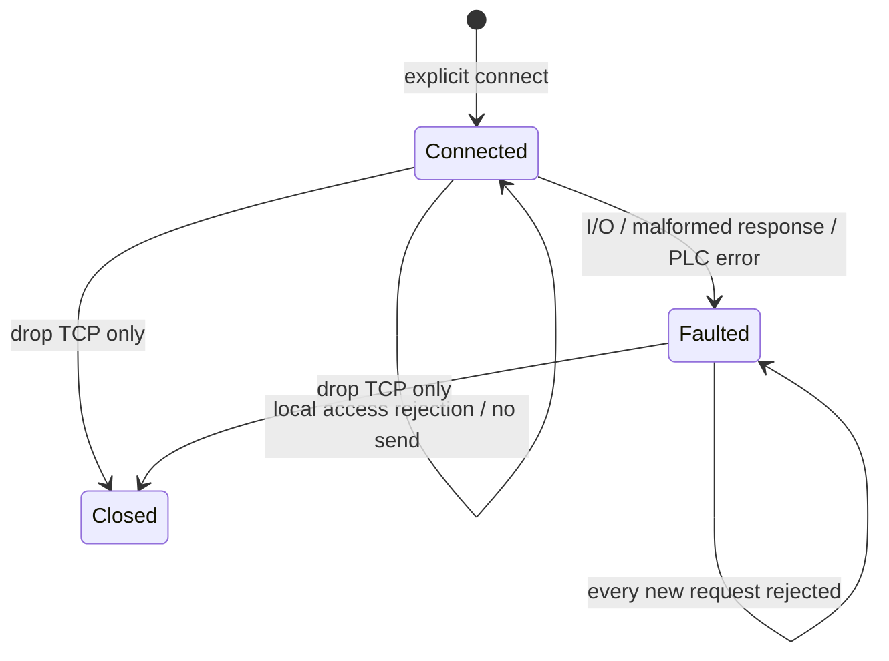

# MELSEC MC 3E 통신 계층 — 구현 초안

작성 2026-09-12. 상태: **통신 라이브러리 구현, 로컬 모의 TCP 시험 완료; 서명된 장비 패키지로 Host backend 선택 가능, 실제 현장 qualification은 미완료**.

이 라이브러리는 `rx-solutions` 안에서 미쓰비시 PLC에 제한된 MC 요청을 보내고 응답을 해석한다. ROS와 Platform domain을 의존하지 않는다. 장비 제어의 허가·원장·완료 판정은 상위 Host 어댑터의 책임이다. 제한 상태 보장 어댑터의 현재 구현은 [MELSEC Host 명세](../../runtime/rx-host/MELSEC_ADAPTER.md)에 둔다. 설치·연결·물리 운전 승인을 이 라이브러리가 제공하지 않는다.

## 1. 대상과 근거

첫 레이저 PLC는 사용자가 제공한 사진의 **Q03UDVCPU**다. 해당 모델은 제조사의 내장 Ethernet 매뉴얼 대상이며, MC 0401 읽기와 1401 쓰기 명령이 기재되어 있다. 실제 포트 설정·RUN 중 쓰기 허용·주소 할당은 현장 확인이 필요하다. [QnUCPU 내장 Ethernet 매뉴얼, §5](https://dl.mitsubishielectric.com/dl/fa/document/manual/plc/sh080811eng/sh080811engy.pdf).

코덱은 3E binary frame, little-endian 길이/word, M=0x90, D=0xA8, bit당 4비트와 홀수 개수의 하위 zero padding을 따른다. 근거: [MC Protocol Reference, 인쇄 p43–44, p72–74, p90–96, Appendix 7](https://dl.mitsubishielectric.com/dl/fa/document/manual/plc/sh080008/sh080008ab.pdf).

사진의 CC-Link 모듈·원격 I/O가 있다는 사실로 MC용 주소나 제어 권한을 추정하지 않는다. MC 접근은 CPU와의 상위 통신 후보이고 기존 CC-Link I/O 회로를 자동으로 대체하지 않는다. 이 라이브러리는 FANUC·Siemens 호환 드라이버가 아니다.

## 2. 구현 API와 제한

| API | 실제 처리 | 응답의 의미 |
|---|---|---|
| `Configuration::validate` | 명시적 주소/route/timeout/access 검사 | 문법·로컬 정책 적합. 현장 검증이 아님 |
| `Client::connect` | 지정 IPv4에 TCP 연결 | 프로토콜 요청·자동 probe 없음 |
| `read_m(first,count)` | 허용 범위 내 M bit 1–64개 읽기 | 현재 응답의 raw bool. 시각·신선도·안전 판정 없음 |
| `read_d(first,count)` | 허용 범위 내 D word 1–32개 읽기 | raw u16. 순서/세대 의미는 상위 프로파일에 필요 |
| `write_m(address,value)` | 열거한 M request bit 한 개 쓰기 | 정확한 end-code-zero 응답의 `WriteAcknowledgement` |
| `is_faulted` | 연결의 영구 오류 상태 조회 | 이전 작업의 성공/실패 판정이 아님 |

`Configuration::write_m_frame`은 허용된 단일 M 요청의 송신 예정 bytes만 순수하게 반환해 native journal에 고정한다. 임의 bytes를 보내는 API는 없다.

다른 device code, word 쓰기, 임의 frame 송신, remote RUN/STOP, 프로그램·파라미터 변경, 자동 reset/heartbeat는 공개 API에 없다. 메모리 M도 PLC 프로그램에 의해 동작을 유발할 수 있으므로 쓰기는 일반적인 변수 수정으로 취급하지 않는다.

`Configuration`은 endpoint, 5개 route byte, monitoring timer, 접속/교환 timeout, CPU 설정에 따른 M/D 마지막 주소, 읽기 범위, 쓰기 주소 목록을 모두 명시한다. 주소 숫자는 **10진 device 번호**다. CPU device 설정의 실제 한도와 wire의 24비트 한도를 구분한다. 범위는 정렬·비중복이며 한 read는 단일 허용 범위 안에 있어야 한다. 읽기 범위와 쓰기 주소의 겹침 자체는 허용한다. 그 주소를 완료 근거로 사용할 수 있는지는 별도 semantic profile의 검사 대상이다.

SIMULATION 설정은 loopback endpoint만 허용한다. PHYSICAL 설정은 문법상 외부 주소를 표현할 수 있다. 이번 시험은 모두 loopback이며 PHYSICAL 예시는 문법 검사만 한다. 이 enum만으로 OS 네트워크 격리나 연결 권한이 생기는 것은 아니다. IPv4 unicast 기본 검사를 하며 subnet별 broadcast 판별·방화벽·현장 route 허용목록은 배포 계층의 책임이다.

## 3. 응답 유실과 연결 상태



3E 연결에는 요청 하나만 진행한다. `&mut Client`가 동시 교환을 직렬화한다. 자동 reconnect/retry는 없으며 한 번 오류가 난 객체는 계속 거부한다. 새로운 Client를 만들더라도 이전 작업을 다시 보내도 된다는 의미가 아니다. 운영 어댑터는 이보다 강한 영속 작업 동일성과 재진입 금지를 제공해야 한다.

실패는 `BeforeSend`와 `ExchangeEntered`를 나눈다. 후자는 송신 경계에 들어갔다는 보수적인 분류이며 실제 PLC 수신을 증명하지 않는다. 쓰기 교환 중 응답 유실·형식 오류·PLC 오류 코드는 `write_outcome_unknown=true`로 보존한다. 명확한 PLC 오류도 이 계층만으로 물리 무효과를 추정하지 않는다. 이후 faulted 객체의 새 호출이 `BeforeSend`로 거부되어도 **이전 쓰기의 UNKNOWN은 그대로 남는다**.

쓰기 ACK에는 address/requested_value만 있다. 완료·성공·센서 상태·operation ID를 담지 않는다. ACK를 NativeCapture 성공으로 바로 변환하면 안 된다. reads도 단순 raw 응답이므로 `origin_age_bounded=true`나 안전 interlock PASS로 자동 승격하지 않는다.

## 4. 통신과 자원 경계

각 요청의 전체 송신과 전체 응답에 하나의 deadline을 사용한다. 부분 응답마다 남은 시간을 다시 계산하므로 바이트를 조금씩 보내 timeout을 무한 연장할 수 없다. 접속과 교환은 각각 최대 5초의 소프트웨어 한도이고 OS scheduling에 대한 hard realtime 보장은 아니다. monitoring timer는 1–20의 250ms 단위이며 Host 교환 timeout보다 길 수 있다. 그 경우 Host timeout 뒤에도 PLC 처리 가능성이 남으므로 UNKNOWN을 보존한다.

응답 subheader·route·길이·end code·정확한 payload 크기·bit 값·padding을 검사한다. 본문은 최대 258바이트만 할당하며 과대 길이는 본문을 기다리지 않고 거부한다. PLC 오류의 코드와 bounded diagnostic을 반환한다. 오류 뒤에는 TCP shutdown을 시도하되 shutdown 성공을 물리 동작 중단으로 해석하지 않는다.

MC 연결 자체에 RX mTLS/사용자 인증·메시지 서명이 추가되는 것은 아니다. 이 구현은 지정 PLC가 하나의 요청에 하나의 응답을 순서대로 준다는 신뢰를 전제로 한다. 가짜 peer·중복/비요청 응답에 대한 암호학적 상관관계를 제공하지 않는다. 현장 전용 통신 경계, 검토된 endpoint와 접근 제어가 필요하다.

drop은 TCP 핸들을 닫는다. 척 해제·문 열기·서보 off·reset을 전송하지 않는다. TCP close 뒤에도 PLC의 제어·소재 지지가 유지되는지를 이 라이브러리는 알 수 없다. Host의 `shutdown_snapshot` 구현과 검증은 [후속 어댑터 설계](HOST_ADAPTER_PLAN.md)를 따른다.

## 5. 시험과 배포 상태

`tests/transport.rs`는 실제 loopback TCP server에 독립적인 고정 frame을 대조한다. 공식 예시를 이용한 M/D 해석, 쓰기 ACK, 응답 유실 후 effects 1개 유지, 접근 거부 시 0 byte, PLC 오류 보존, 잘못된 길이/route/bit/padding, 지연 조각 응답의 전체 deadline, passive connect/drop을 시험한다. 서버의 effects는 **모의 memory write 계수**이며 실장비 동작 수가 아니다.

```sh
CARGO_INCREMENTAL=0 ./tools/cargo test -p rx-melsec-mc --locked --offline
CARGO_INCREMENTAL=0 ./tools/cargo clippy -p rx-melsec-mc --all-targets --locked --offline -- -D warnings
```

명령은 `rx-solutions`에서 실행한다. 패키지는 workspace library이며 CLI가 없다. Host crate가 이 라이브러리를 사용하며 [MELSEC_PACKAGE](../../runtime/rx-host/DEVICE_PACKAGE_STARTUP.md)로 제품에서 선택한다. 서명/설정 검증과 실제 물리 운전 자격은 별개다. 기존 FILE_SIMULATION도 유지하고 첫 물리 셀은 **NOT_COMMISSIONED**다.
