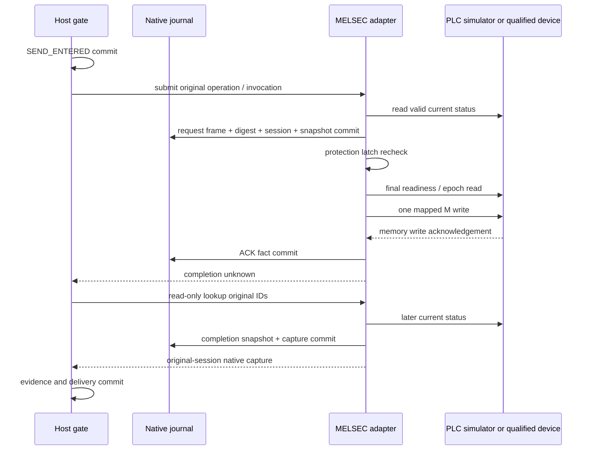

# MELSEC 상태 보장 어댑터 — 원장·관측·Host 연결

작성 2026-09-12. 구현: `src/melsec/`, 시험: `tests/melsec.rs`.

**제한된 EnsureState NativeAdapter와 Host 라이브러리 통합을 구현했다.** 실제 TCP를 사용하는 모의 PLC로 검증한다. phase58에서 [서명된 package factory](DEVICE_PACKAGE_STARTUP.md)에 등록했으며, 실제 레이저 장비의 주소·프로그램·완료 신호는 미확정이다. 첫 물리 셀은 NOT_COMMISSIONED다.

## 1. 지원하는 의미

`EnsureState + Predicate(Boolean)`만 받는다. target, site configuration, calibration, resource set, profile digest, predicate ID와 settle 값이 정확히 맞아야 한다. 완료 규칙은 `rx.melsec.debounced-predicate.v1`, 취소 규칙은 `rx.melsec.no-native-cancel.v1`이다.

해당 profile의 PLC 프로그램이 요청 M bit를 **지속 목표 상태**로 해석해야 한다. debounced completion bit는 지정 settle 시간 동안 안정된 목표 상태를 나타내며, ON/OFF 양쪽 값의 의미를 검증해야 한다. 이 어댑터가 폴링 간격을 센서의 연속 안정 시간으로 추정하지 않는다.

현재 목표 상태가 이미 충족되어 있고 제어·queue 조건이 맞으면, 쓰기 없이 predicate-satisfied capture를 저장한다. 이것은 “이번 invocation이 장치를 움직였다”라는 증거가 아니다. edge/pulse로 실행 횟수가 중요한 공정 시작·집기에는 이 어댑터를 사용하지 않는다. 그런 작업은 native request/ack identity와 별도 mailbox 계약이 필요하다.

## 2. 상태 publication 계약 — MC의 기본 보장이 아님

이 구현은 PLC 또는 해당 장치의 검증된 publication 계층이 아래 **9개 D word를 한 관측 이미지로 제공한다는 별도 계약**을 전제로 한다.

| word offset | 값 | 필수 의미 |
|---|---|---|
| 0–3 | `plc_epoch:u64` | boot/프로그램 세대가 바뀌면 변경, 0 금지 |
| 4–7 | `publication_sequence:u64` | 매 publication 갱신 시 증가, 0·후퇴·같은 세대의 wrap 금지 |
| 8 | `flags:u16` | valid/ready/queue-empty/control/support/drop-allowed와 predicate/source bit |

u64는 낮은 word부터 표현한다. status bit 여섯 개는 서로 달라야 하고 completion bit와 겹치지 않는다. source·condition 이름은 명시적으로 bit에 매핑한다. 쓰기 M 주소도 predicate마다 하나로 열거하며 사용하지 않는 write 권한을 profile에 남길 수 없다.

**MC batch read가 이 원자적 이미지·실제 센서 freshness·debounce를 자동 보장한다고 주장하지 않는다.** `publication_contract`와 `plc_program` digest는 후속 검증에 묶을 참조다. 현재 Profile validator는 digest의 원본·서명·현장 의미를 검증하지 않는다. 해당 보장을 제공하지 못하는 기존 PLC 프로그램을 이 형식으로 읽기만 해서 지원 완료로 만들 수 없다. 실제 적용은 프로그램/게이트웨이 적합성 또는 대체 어댑터를 검토해야 한다.

최초 read는 publication의 진행을 증명하지 못하므로 Guard로 거부한다. 이후 더 큰 sequence를 한 번 관측한 뒤에야 source/guard를 제공한다. 같은 sequence에 flags가 바뀌면 이미지 무결성 오류이며, sequence 후퇴·epoch 변경·publication 정체·시계 역행/부트 변경·통신 오류는 새 쓰기의 보호 latch를 건다.

source 최대 age와 read budget은 각각 1–50ms, guard 유효기간은 1–50ms다. native 송신 직전 read가 read budget 안에 들어왔더라도 guard 유효기간이 이미 지났다면 쓰기를 거부한다. 이는 현재 구현의 소프트웨어 지원 범위이며 실제 PLC 성능 측정값이 아니다. source 시각에는 Host read 시작을 쓰고, 선언한 원본 age 및 read/관측 지연을 uncertainty에 포함한다. `origin_age_bounded=true`는 **검증된 publication 계약 아래에서만** 해석해야 한다. factory는 해당 원본과 서명을 확인하고, 물리 운전은 현재 Platform qualification acceptance 이후에만 허용한다. factory가 그 계약의 물리적 참을 증명하는 것은 아니다. 모의 시험은 이 publication 조건을 구현한 서버에서 수행한다.

## 3. 새 원장 생성과 기존 원장 열기

`Melsec::initialize(directory, profile)`는 새 디렉토리에 독립 SQLite 원장을 만들고 `Identity { journal, profile }`을 반환한다. PLC 연결이나 read/write를 하지 않는다. 호출자는 이 identity를 installation 구성에 고정해야 한다. 기존 디렉토리에는 초기화하지 않는다.

`Melsec::open(directory, identity, profile, clock)`는 기존 DB만 연다. 누락·빈 파일·symlink DB·다른 journal ID·다른 profile을 거부한다. SQLite 소유 lock/무결성, meta/operation 개수·pending index·invocation index와 각 작업의 intent/body·request frame·capture 근거를 대조한다. 한 번 open할 때 새 device session을 만들며 이전 session을 현재 것으로 복원하지 않는다.

실제 TCP 연결은 첫 read까지 지연한다. 초기화 실패 후 남은 부분 디렉토리를 자동 삭제하거나 새 설치로 완성하지 않는다. 제품 factory는 비공개 staging에서 초기화하고 identity를 함께 원자 공개한다. 단독 Melsec library initialize는 이 상위 공개 절차를 대신하지 않는다. 운영 중 백업을 임의로 덮어쓰거나 원장을 교체하는 것은 이 API의 지원 경로가 아니다.

## 4. 명령과 기록 경계

native entry에는 operation/invocation, 정규 intent digest, profile digest, device session, PLC epoch, M 주소/목표 값, **실제 송신 예정 frame bytes와 SHA-256**, 최초 status snapshot, 진입 시각을 기록한다. 이미 충족된 경우도 같은 frame을 “예정 요청”으로 보관하되 ACK 없이 capture를 기록하며 실제 송신하지 않는다. 기록 존재는 wire 송신을 증명하지 않는다.

새 entry·invocation index·event·pending slot은 한 transaction으로 기록한다. 실제 native 호출은 transaction 밖이다. 기록 후 다시 status와 보호 latch를 확인해 조건이 바뀌면 쓰기를 거부하되 원래 pending 기록은 유지한다. 한 어댑터에 미해결 작업 하나만 허용한다. 다른 operation ID로 우회하지 못한다.

쓰기 ACK는 별도로 저장한다. ACK만 받은 `submit`은 NativeUnknown을 반환하며 Host delivery는 SEND_ENTERED에 남는다. NativeAccepted/성공을 임의로 만들지 않는다. 원래 ID의 `submit` 반복은 보관된 capture 또는 미확인 상태를 반환할 뿐 다시 송신하지 않는다.

## 5. Lookup과 재시작

| 현재 보관 상태 | Lookup 행동 |
|---|---|
| entry 없음 | None. 새 송신 없음 |
| 같은 operation의 다른 invocation | 충돌 |
| capture 있음 | 원래 session의 불변 capture 회수. 현재 PLC를 다시 움직이지 않음 |
| ACK 없거나 새 프로세스의 session | None. 과거 효과 추정·재송신 없음 |
| 같은 session의 ACK 있고 미완료 | read-only status 관측 |
| 같은 session의 ACK 있는 미완료 작업에서 별도 completion bit·queue-empty·더 새 publication 확인 | snapshot/capture/event와 pending 해제를 원자 저장 |

완료 capture는 `rx.melsec.predicate-satisfied.v1`, status 0, 원래 device session과 epoch/sequence native ID를 가진다. 이 스키마를 Platform outcome으로 해석하는 실제 장비 Profile/qualification 연결은 후속이다. Host는 이 사실을 evidence로 저장할 뿐 전역 작업의 성공을 독자적으로 결정하지 않는다.

응답 유실·PLC 오류로 ACK가 없는 작업이나 프로세스 재시작 후 미완료 작업은 현재 상태가 목표와 같아 보여도 이 구현의 Lookup만으로 해소하지 않는다. 일단 새로운 연결을 만들어 이전 작업을 재실행하는 API도 없다. 승인된 복구 절차에서 미해결 효과와 자원 처분을 따로 다루는 후속 연동이 필요하다. 이로 인해 현장 복구 전에는 운전이 계속 차단될 수 있다.

과거 capture를 재사용할 때 source snapshot과 native request까지 대조한다. 캡처된 값과 센서 근거가 모순된 저장 자료를 새 부팅의 정상 사실로 채택하지 않는다. 저장 내용 전체를 공격자가 함께 바꾼 경우를 탐지하는 서명 원장은 아니며, trusted storage/백업·복원 정책을 대체하지 않는다.

## 6. 인계·종료·보호

handover는 profile의 전체 resource set에만 제공한다. native pending 없음과 PLC queue-empty, control, support를 따로 반환한다. shutdown은 pending 없음·queue-empty·support와 **별도 drop-allowed**가 모두 필요하다. support만 좋아도 drop-allowed가 false면 정상 종료할 수 없다.

`LocalProtection`은 Host gate/DB와 독립된 atomic latch로 새 쓰기를 차단한다. 이미 진행 중인 PLC 처리나 물리 운동을 중단시킨다고 주장하지 않는다. 보호·drop에서 척 열기/torque off/reset을 자동 송신하지 않는다. 장비의 현지 보호는 별도로 검증해야 한다.

현재 오류 연결은 재접속하지 않는다. 따라서 통신 장애 후 drop proof를 읽을 수 없으면 정상 stop은 owner를 유지한다. 기존 연결이 살아 있으면 latch 뒤에도 read-only 사실 조회는 가능하다. 진단용 재접속·복구 사건에 따른 pending 해소·운영 화면 연결은 아직 미완료다.

## 7. 검증과 현재 배포 범위

`tests/melsec.rs`의 모의 PLC는 요청 byte와 주소를 검사하고 memory write 계수와 별도 completion flag를 관리한다. ACK가 완료 bit를 자동 변경하지 않는 것이 기본값이다. 별도 crash fixture에만 완료 변화를 추가한다.

검증 내용: ACK/완료 분리, 미해결 작업의 새 ID 우회 거부, 이미 충족된 상태의 쓰기 0, 답변 유실/재시작 후 추가 송신 0, 캡처의 원래 session 보존, epoch/sequence/정체/모순 차단, support/drop 구분, scope/profile/원장 교체 거부, 송신 직전 조건 변경, 저장 capture 손상 거부. 실제 Host library의 Arm 전 거부→prepare→authorize→SEND_ENTERED→Lookup→evidence→인계/stop도 연결했다.

별도 자식 프로세스를 native entry commit 직후, 쓰기 후 ACK commit 전, 이미 충족된 capture commit 후, 실제 쓰기·완료 capture commit 후에 종료한다. 종료는 `process::exit(86)`으로 Rust destructor를 건너뛰며 재시작 후 같은 invocation의 추가 native write가 없는지 대조한다. 이는 power loss/fsync 고장이나 PLC의 물리적 exactly-once를 검증한 것이 아니다. child 전용 테스트는 일반 목록에서 ignored지만 부모 시험이 네 번 명시 실행한다.

새 crate를 포함하도록 Solutions Dockerfile의 `drivers` 복사를 추가했다. 기존 FILE_SIMULATION과 별도로 MELSEC_PACKAGE를 명시 선택할 수 있다. 구체 설정 검증과 물리 qualification을 구분한다.

남은 사항: publication 계약의 물리적 성립·실제 프로그램/장치 일치 검증, 첫 현장의 실제 source/주소와 physical qualification, 일반 driver factory·업데이트/복원, 실제 P outcome/프로파일과 재검증 통합, 전체 복구·새 세대 조정·진단 reconnect, native journal 10,000개 한도 이후 보관/유지보수, 장기·부하·실물 시험. 자사 ROBOTIS 기본 지원 및 전체 요구는 [구현 추적표](../../../docs/implementation/requirements.md)를 따른다.

검증 명령·플랫폼별 결과·소스 hash와 archive는 [phase57 검증 기록](../../../references/implementation/phase57_checks.json)에 둔다. 해당 보고서의 PASS는 명시된 모의/소프트웨어 범위에 한정한다.

이번 검증 결과: macOS 솔루션 전체116개·workspace clippy, Linux Host/통신67개, 이후 실제 Linux CLOCK_BOOTTIME 시나리오를 포함한 MELSEC14개가 통과했다. 최종 S image의 제품 Host·진단·관리 smoke도 통과했다. 각 범위는 중복된 시험을 포함하므로 숫자를 합산하지 않는다. Linux clippy는 미설치로 미수행이다.
