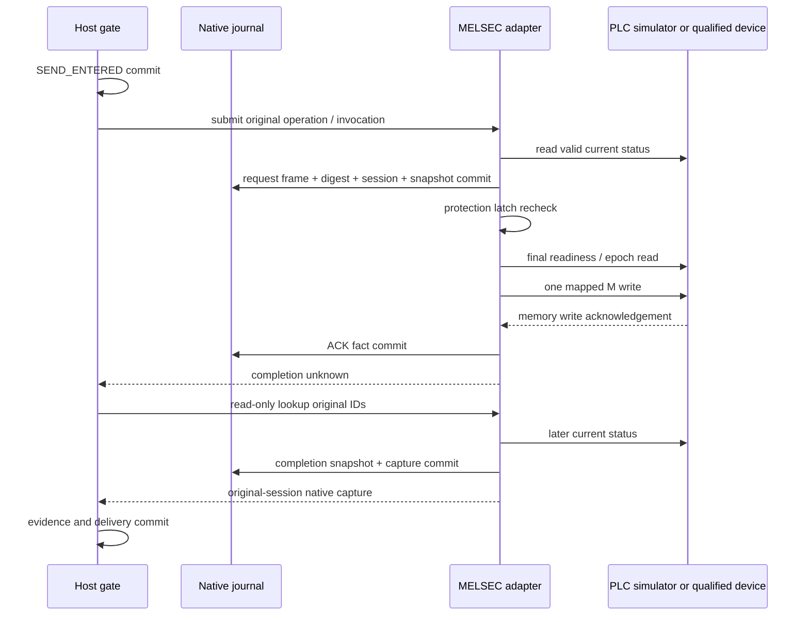

# MELSEC state-ensuring adapter — journals, observations and Host integration

Written 2026-09-12. Implementation: `src/melsec/`; tests: `tests/melsec.rs`.

**A restricted EnsureState NativeAdapter and Host library integration are implemented.** Verification uses a simulated PLC over actual TCP. It was registered in the [signed package factory](DEVICE_PACKAGE_STARTUP.md) in phase58; the actual laser equipment's addresses, program and completion signals remain undecided. The first physical cell is NOT_COMMISSIONED.

## 1. Supported semantics

Only `EnsureState + Predicate(Boolean)` is accepted. The target, site configuration, calibration, resource set, profile digest, predicate ID and settle value must match exactly. The completion rule is `rx.melsec.debounced-predicate.v1`; the cancellation rule is `rx.melsec.no-native-cancel.v1`.

The PLC program for the profile must interpret the requested M bit as a **persistent target state**. The debounced completion bit represents a target state stable for the designated settle duration; the meanings of both ON and OFF values must be verified. The adapter does not infer continuous sensor stability from its polling interval.

If the current target state is already satisfied and control/queue conditions match, it stores a predicate-satisfied capture without writing. This is not evidence that “this invocation moved the device.” Do not use this adapter for process starts or picks where execution counts depend on edges/pulses. Such operations require native request/ack identity and a separate mailbox contract.

## 2. Status publication contract — not a default MC guarantee

This implementation assumes a separate contract under which the PLC or a validated publication layer for the device **provides the following 9 D words as one observation image**.

| Word offset | Value | Required meaning |
|---|---|---|
| 0–3 | `plc_epoch:u64` | Changes with boot/program generation; 0 prohibited |
| 4–7 | `publication_sequence:u64` | Increases on every publication update; 0, regression and wrap within the same generation prohibited |
| 8 | `flags:u16` | valid/ready/queue-empty/control/support/drop-allowed and predicate/source bits |

u64 values are represented lowest word first. The six status bits must be distinct and must not overlap completion bits. Source/condition names are explicitly mapped to bits. One write M address is also enumerated per predicate; unused write permissions must not remain in the profile.

**MC batch read is not claimed to automatically guarantee this atomic image, actual sensor freshness or debounce.** The `publication_contract` and `plc_program` digests are references for binding subsequent verification. The current Profile validator does not verify digest originals, signatures or site semantics. Merely reading an existing PLC program in this format cannot establish completed support if it cannot provide those guarantees. Actual application requires reviewing program/gateway suitability or an alternative adapter.

The first read cannot prove publication progress and is therefore rejected as a Guard. Source/guard are provided only after observing a greater sequence once. Changed flags at the same sequence are an image-integrity error; sequence regression, epoch change, stalled publication, clock regression/boot change and communication errors engage a protection latch against new writes.

Maximum source age and read budget are each 1–50 ms; guard validity is 1–50 ms. Even if the read immediately before native transmission meets the read budget, writing is rejected if guard validity has already expired. These are the current implementation's software support bounds, not measured actual PLC performance. Source time uses the Host read start, and uncertainty includes the declared origin age and read/observation delays. `origin_age_bounded=true` must be interpreted **only under a validated publication contract**. The factory checks those originals and signatures, and physical operation is allowed only after current Platform qualification acceptance. The factory does not prove the physical truth of that contract. Simulation tests use a server implementing these publication conditions.

## 3. Creating a new journal and opening an existing journal

`Melsec::initialize(directory, profile)` creates an independent SQLite journal in a new directory and returns `Identity { journal, profile }`. It does not connect to the PLC or read/write it. The caller must pin this identity in the installation configuration. Existing directories are not initialized.

`Melsec::open(directory, identity, profile, clock)` opens only an existing DB. It rejects missing/empty files, symlink DBs, different journal IDs and different profiles. It compares SQLite ownership locks/integrity, meta/operation counts, pending/invocation indexes and each operation's intent/body, request frame and capture evidence. Each open creates a new device session; it does not restore an old session as current.

Actual TCP connection is deferred until the first read. A partial directory left after initialization failure is neither automatically deleted nor completed as a new installation. The product factory initializes in private staging and atomically publishes the identity together with it. Standalone Melsec library initialize does not replace this higher-level publication procedure. Arbitrarily overwriting a backup or replacing journals during operation is not a supported path through this API.

## 4. Command and recording boundaries

The native entry records operation/invocation, canonical intent digest, profile digest, device session, PLC epoch, M address/target value, **actual frame bytes planned for transmission and their SHA-256**, initial status snapshot and entry time. When already satisfied, it retains the same frame as a “planned request” but records a capture without ACK and does not transmit it. Record existence does not prove wire transmission.

A new entry, invocation index, event and pending slot are recorded in one transaction. The actual native call is outside that transaction. After recording, status and the protection latch are checked again; changed conditions reject the write while preserving the original pending record. Only one unresolved operation is allowed per adapter. Another operation ID cannot bypass it.

Write ACK is stored separately. `submit` with only an ACK returns NativeUnknown, and Host delivery remains SEND_ENTERED. It does not fabricate NativeAccepted/success. Repeated `submit` of the original ID returns only the retained capture or unconfirmed state without transmitting again.

## 5. Lookup and restart

| Currently retained state | Lookup behavior |
|---|---|
| No entry | None. No new transmission |
| Different invocation for the same operation | Conflict |
| Capture exists | Retrieve immutable capture from original session. Do not actuate the current PLC again |
| No ACK, or session belongs to a new process | None. No inference of past effects or retransmission |
| ACK in the same session, not completed | Read-only status observation |
| Separate completion bit, queue-empty and newer publication confirmed for unfinished work with ACK in the same session | Atomically store snapshot/capture/event and clear pending |

Completion capture uses `rx.melsec.predicate-satisfied.v1`, status 0, the original device session and an epoch/sequence native ID. Connecting an actual device Profile/qualification that interprets this schema as a Platform outcome remains future work. The Host stores these facts as evidence; it does not independently determine global operation success.

Work without ACK after response loss/PLC error, or unfinished work after process restart, is not resolved by this implementation's Lookup alone even if the current state appears to match the target. There is also no API that first creates a new connection and re-executes old work. Further integration must handle unresolved effects and resource disposition separately through an approved recovery procedure. Operation may therefore remain blocked until field recovery.

Reusing a historical capture also compares its source snapshot and native request. Stored data whose captured values contradict sensor evidence is not adopted as a valid fact for a new boot. This is not a signed ledger that detects an attacker changing all stored content together, and does not replace trusted storage or backup/restoration policy.

## 6. Handover, shutdown and protection

Handover is provided only for the profile's full resource set. Absence of native pending work, PLC queue-empty, control and support are returned separately. Shutdown requires no pending work, queue-empty, support and **separate drop-allowed**. Good support alone does not permit normal shutdown if drop-allowed is false.

`LocalProtection` blocks new writes through an atomic latch independent of the Host gate/DB. It is not claimed to stop PLC processing or physical motion already in progress. Protection/drop does not automatically send chuck-open, torque-off or reset commands. Local device protection must be validated separately.

A faulted connection is not currently reconnected. If communication failure prevents reading drop proof, normal stop retains the owner. Read-only fact queries remain possible after the latch if the existing connection is alive. Diagnostic reconnection, pending resolution through recovery events and operational UI integration are still incomplete.

## 7. Verification and current deployment scope

The simulated PLC in `tests/melsec.rs` checks request bytes and addresses and maintains a memory-write count and separate completion flag. By default, ACK does not automatically change the completion bit. Completion changes are added only to a separate crash fixture.

Verification covers ACK/completion separation, rejection of new-ID bypass for unresolved work, zero writes for already satisfied state, zero additional sends after response loss/restart, original session preservation in captures, epoch/sequence/stall/contradiction blocking, support/drop distinction, scope/profile/journal replacement rejection, changed conditions immediately before transmission and rejection of corrupt stored captures. Actual Host library integration also connects rejection before Arm→prepare→authorize→SEND_ENTERED→Lookup→evidence→handover/stop.

Separate child processes are terminated immediately after native entry commit, after write but before ACK commit, after already-satisfied capture commit, and after actual write/completion capture commit. Termination uses `process::exit(86)` to skip Rust destructors; after restart, the same invocation is checked for no additional native writes. This does not validate power loss, fsync failure or physical exactly-once behavior of the PLC. Child-only tests are ignored in the ordinary listing but are explicitly run four times by the parent test.

The Solutions Dockerfile now copies `drivers` to include the new crate. MELSEC_PACKAGE can be explicitly selected separately from existing FILE_SIMULATION. Concrete configuration verification is distinct from physical qualification.

Remaining work: physical validity of the publication contract and actual program/device agreement, actual sources/addresses and physical qualification at the first site, generic driver factory and updates/restoration, integration with actual P outcomes/profiles and revalidation, full recovery/new-generation reconciliation/diagnostic reconnect, retention/maintenance beyond the native journal's 10,000-entry limit, and long-term/load/physical testing. Vendor-neutral device integration and full requirements follow the [implementation traceability table](https://github.com/jack0682/rx_docs/blob/main/docs/implementation/requirements.md).

Verification commands, platform-specific results, source hashes and archives are retained in the [phase57 verification record](https://github.com/jack0682/rx_docs/blob/6111a7d1dcf33052f38c3e67c6585aec2b44df3c/references/implementation/phase57_checks.json). PASS in that report is restricted to the stated simulation/software scope.

Results of that verification: all 116 macOS solutions tests and workspace clippy passed; 67 Linux Host/communication tests passed; later, 14 MELSEC tests including an actual Linux CLOCK_BOOTTIME scenario passed. Product Host, diagnostics and administration smoke checks in the final S image also passed. These scopes overlap, so their counts must not be summed. Linux clippy was not run because it was not installed.
